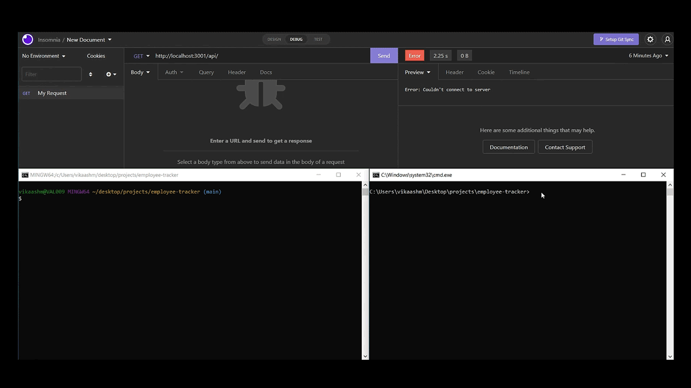

  <h1 align="center"><b>Hi there, I'm Vik</h1>

 

Full stack web developer since, well, now.

 

<h2 align="center">My selected projects 💻</h2>
 

  <a href="https://github.com/Vik-Maharaj/vik-maharaj-web-portfolio">
  <a href="https://github.com/Vik-Maharaj/fruitbook">
 
  
  <a href="https://github.com/Vik-Maharaj/employee-tracker">
  <a href="https://github.com/Vik-Maharaj/team-profile-generator">
  

  <a href="https://github.com/Vik-Maharaj/code-quiz">
  <a href="https://github.com/Vik-Maharaj/weather-dashboard">
  

 

<h2 align="center">About me</h2>
 

 

<h3 align="center"> Languages and Tools</h3>

 

  

