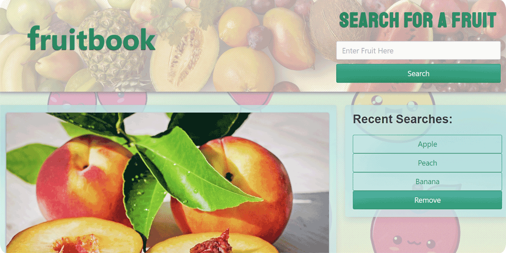
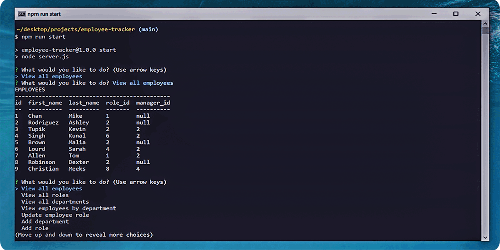
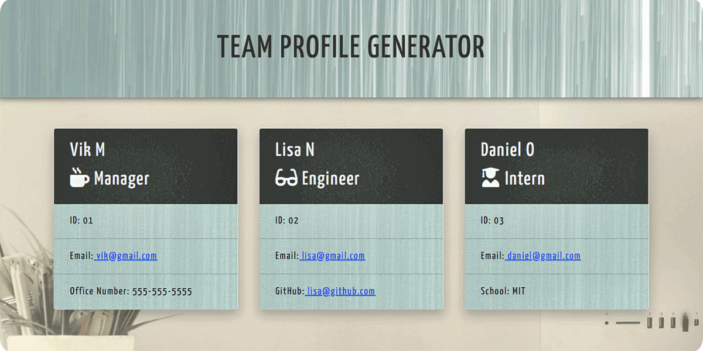
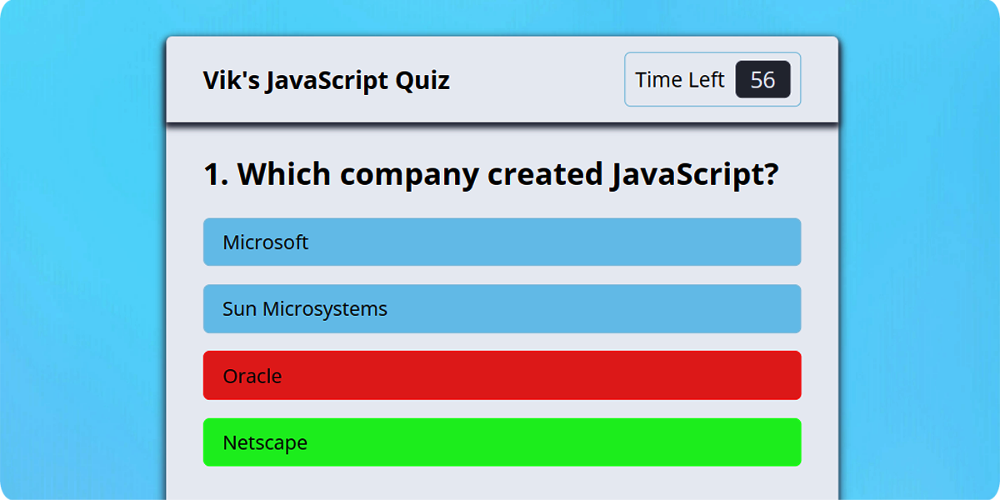
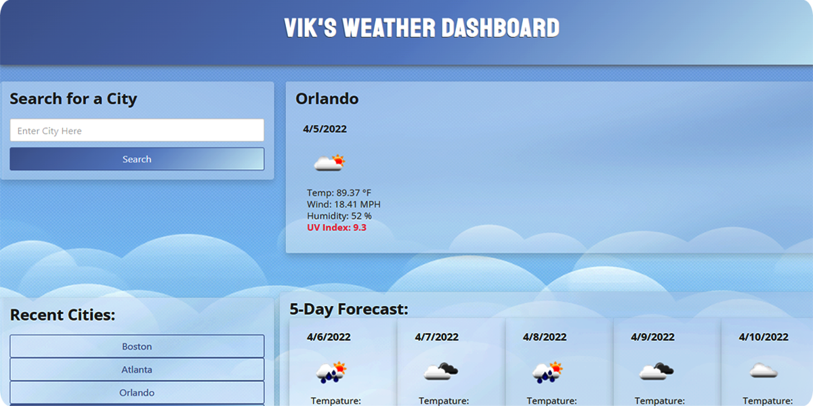

 

<h2 align="center">My Selected Projects 💻</h2>
 

  <a href="https://github.com/Vik-Maharaj/vik-maharaj-web-portfolio">
  <a href="https://github.com/Vik-Maharaj/fruitbook">
 
  
  <a href="https://github.com/Vik-Maharaj/employee-tracker">
  <a href="https://github.com/Vik-Maharaj/team-profile-generator">
  

  <a href="https://github.com/Vik-Maharaj/code-quiz">
  <a href="https://github.com/Vik-Maharaj/weather-dashboard">
  

 

<h2 align="center"> Languages and Tools Used</h2>

 

  

